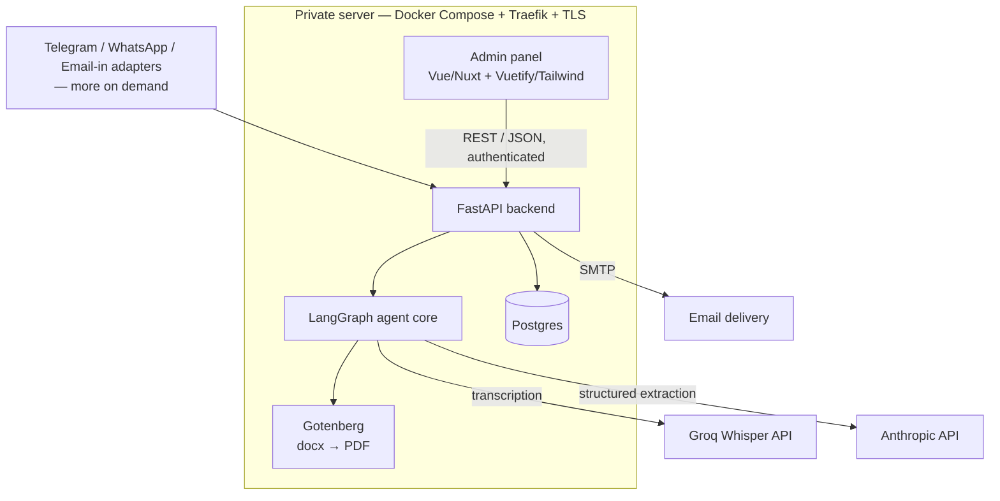
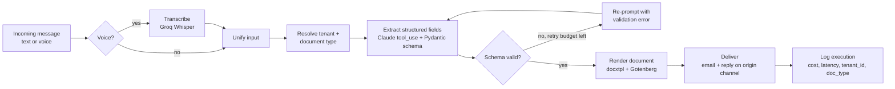
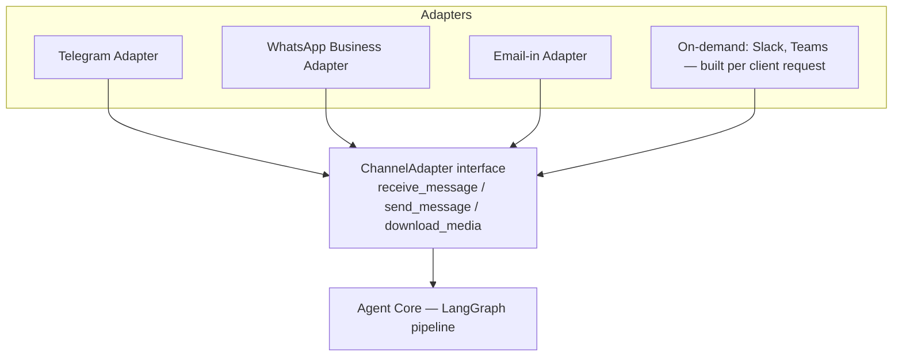

# ReportAI — Development Roadmap

## 1. Overview

ReportAI is an AI agent that turns a voice note or a chat message into a
correctly formatted document (meeting minutes, commercial visit reports, and
future document types), filled into the client's own template and delivered
to the right inbox. Multi-tenant from the data model up: each client
configures their own instance (document templates, fields, channels, users,
recipients) from an admin panel.

This is a working development tracker — phases, checklists, and technical
decisions — not a presentation document.

## 2. Architecture

### Agent pipeline (LangGraph)

### Channel adapter pattern

### Stack summary

- **Backend**: FastAPI, Python
- **Agent orchestration**: LangGraph
- **LLM extraction**: Anthropic Claude, tool-calling / structured output
- **Transcription**: Groq Whisper (whisper-large-v3-turbo)
- **Database**: Postgres, self-hosted (Docker)
- **Document rendering**: docxtpl + self-hosted Gotenberg
- **Admin panel**: Vue/Nuxt + Vuetify/Tailwind
- **Channels**: Telegram, WhatsApp Business Cloud API, Email-in (initial build); Slack and Microsoft Teams built on-demand per client request; Discord, Google Chat, SMS, RCS evaluated and not prioritized (see §5 Phase 3)
- **Infra**: private server (Hetzner-class VPS), Docker Compose, Traefik reverse proxy, Let's Encrypt TLS
- **Auth**: per-tenant login (email/password or magic link), roles: platform super-admin / tenant admin
- **Observability**: structured per-execution logs (cost, latency, tenant_id, document_type)
- **Testing**: unit tests per pipeline node, golden-set eval suite in CI

## 3. Architecture & scope decisions

| Decision | Rationale |
|---|---|
| Fully custom-coded agent (no low-code/workflow-builder tools) | A project living entirely in a no-code tool structurally closes the signal channel hiring managers look for: readable commit history, testable/inspectable architecture, real version control. |
| Multi-tenant SaaS from the data model up, with a client-facing admin panel | Each client configures their own instance (templates, fields, authorized users, recipients) themselves, not through a support ticket. |
| Sales motion stays white-label / consulting-led, not public self-serve | No validated demand yet for public self-serve. Software is SaaS-shaped; go-to-market is relationship-led. Public self-serve signup and billing are explicitly deferred (see §6). |
| Channel-agnostic ingestion via an adapter interface; Telegram, WhatsApp, and email-in built in the initial phase | These are the channels the target audience (non-technical SME field reps, Spain/LatAm) actually uses with zero IT gatekeeping. Slack and Microsoft Teams require per-client setup (OAuth install / Azure Bot + IT admin approval) and are built on-demand when a client requests them, not speculatively. |
| Structured LLM output (tool-calling / schema enforcement), never raw-JSON-in-prompt | Removes an entire class of parsing failures versus asking the model for JSON in free text. |
| Document type & field schema as per-tenant runtime config (Pydantic model built from DB config), not hardcoded prompts | A new client or new document type becomes configuration, not a code change. |
| Self-hosted Postgres on a private server, not a managed BaaS | Long-lived, multi-tenant product — warrants owning the infra rather than a managed backend-as-a-service. |
| Own document rendering: docxtpl (Jinja2-tagged .docx templates) → self-hosted Gotenberg (Docker) for docx→PDF | No opaque black-box dependency, no per-document third-party API receiving confidential content off-server. |
| Golden-set eval suite + structured cost/latency logging from the first commit | Highest-leverage investment for both reliability and demonstrable engineering quality, regardless of priority order. |
| Secrets in environment variables / not committed, from the first commit | Non-negotiable baseline for any multi-tenant system handling client documents. |
| Public repository with sanitized/synthetic data only | No real tenant content ever appears in this repo, in eval datasets, or in the public demo. |
| Real incremental commit history from day one | A single big-bang commit or a squashed import reads as a red flag; history must reflect actual development. |

## 4. Data model overview

Core entities, all tenant-scoped from the first migration:

- `tenants` — one row per client company
- `tenant_users` — admin-panel login accounts, scoped to a tenant (+ one super-admin role)
- `channel_connections` — which channel(s) + credentials a tenant has wired up (Telegram bot token, Slack workspace, Discord bot/guild, etc.)
- `document_types` — per-tenant document definitions (name, field schema as JSON, prompt/instructions)
- `document_templates` — the .docx template file reference + version per document type
- `reports` — generated report records (status, requester, timestamps, links to files)
- `execution_logs` — per-run cost, latency, model calls, success/failure, for observability and future billing

## 5. Development phases

### Phase 0 — Foundations
- [x] Repo layout (`backend/`, `frontend/`, `infra/`, `docs/`)
- [x] FastAPI skeleton + Postgres via Docker Compose (local dev)
- [x] Alembic migrations for the core schema (§4), `tenant_id` on every scoped table
- [x] `.env.example`, secrets strictly via environment variables
- [x] Basic CI (lint + test) on push
- [x] `ChannelAdapter` interface defined (no implementation yet)

### Phase 1 — Agent core + initial channels
- [x] LangGraph pipeline: ingest → transcribe → resolve tenant/doc type → extract → validate → render → deliver → log
- [x] Telegram adapter implementing `ChannelAdapter`
- [x] WhatsApp Business Cloud API adapter implementing `ChannelAdapter` (start Meta Business verification early — 2-5 days typical, up to 4-8 weeks)
- [x] Email-in adapter implementing `ChannelAdapter` (inbound email parsing via Mailgun)
- [x] Claude structured-output extraction with per-tenant Pydantic schema
- [x] Retry-with-validation-error loop, bounded attempts
- [x] docxtpl + Gotenberg rendering pipeline
- [x] Email + in-channel delivery
- [x] Golden-set eval suite (synthetic data) + unit tests per node
- [x] Structured execution logging (cost, latency)
- [x] One seeded demo tenant with fictional data end to end (`make seed-demo`)
- [x] Mandatory human-approval interrupt before delivery (not in the original checklist — added per the `ai-agents` skill's non-negotiable rule that no agent sends on a client's behalf without an explicit checkpoint)

### Phase 2 — Admin panel
- [x] Auth — login real (JWT contra `tenant_users`), dashboard placeholder protegido — adelantado junto con la landing (ver §8, 2026-08-11)
  - [x] UI de gestión de tenants para super-admin
  - [x] Recuperación de contraseña / magic link
- [x] Tenant management (create/list/deactivate) — super-admin only
- [x] Document type & template management (upload .docx, define field schema) — tenant admin
- [x] Channel connection management (link bots per channel, manage allowed users) — tenant admin
- [x] Recipients / notification settings — tenant admin
- [x] Report history view with status
- [x] Usage/cost dashboard per tenant

### Phase 3 — On-demand channel adapters (reactive backlog — no work starts here without a specific client request)
- [ ] Slack adapter — build when a specific client requests it (self-service OAuth install, low effort)
- [ ] Microsoft Teams adapter — build only when a specific paying Microsoft 365 client requests it; register as a single-tenant Azure Bot scoped to that client (not a multi-tenant Teams Store app — Microsoft disallowed new multi-tenant bots as of 2025-07-31). Requires that client's IT admin to sideload the app package or approve a store listing; budget 1-2 weeks dev plus client-side admin approval time.
- [ ] Evaluated and explicitly not prioritized: Discord (no fit with formal corporate reporting for this audience), Google Chat (same IT-gated integration cost as Teams, far smaller footprint in this market), SMS (can't carry voice notes — breaks the core "send a voice note" flow), RCS (fragmented, immature cross-carrier/OS support). Revisit only if a specific client asks.

### Phase 4 — Deployment & launch

Scope confirmed 2026-08-15: this phase plus the demo hardening below is the
"finish line" of the project; Phases 3 and 5 stay deferred with their
existing triggers.

**A. Demo-readiness (code, runs locally first)**
- [x] Frontend production build: Dockerfile + Nuxt service in `docker-compose.prod.yml`; single-domain Traefik routing (`/api` prefix → backend, everything else → Nuxt) so prod needs no CORS config and no extra subdomain
- [x] Fix the 2026-08-13 deferred finding: an approval-prompt send failure must still reach the `await_human_approval` interrupt so the report stays approvable from the admin panel — grew into the full resume-cycle fix (see 2026-08-15 decisions-log entry)
- [x] Telegram demo bot config path + webhook registration script shipped (`DEMO_TELEGRAM_BOT_TOKEN`, `scripts/set_telegram_webhook.py`) — **not activated**; see the 2026-08-15 pivot below
- [x] One-click demo access from the landing (demo tenant login without typing credentials) — `POST /auth/demo-login` + read-only guard for the demo account — built and functional, dormant until deployed
- [x] Abuse/cost controls for the public demo: per-sender rate limit, global daily spend cap computed from `execution_logs.cost_usd`, audio size limit
- [x] Scheduled reset of the demo tenant to a clean seeded state — `make reset-demo` + cron line in `infra/README.md`
- [x] Telegram webhook hardening (not in the original checklist — found during Phase 4 exploration): secret-token verification (the other two channels already verified HMAC) and an `is_active` check
- [x] **Real, pre-generated example embedded directly in the landing page** — audio → transcript → extracted fields → PDF, actual pipeline output (`backend/scripts/generate_landing_demo_asset.py`), not a live per-visitor call. This is the actual public-facing proof while the live bot stays dormant (see pivot below).

**B. Infra — deferred, not abandoned (trigger: a real client needs a live public demo)**
- [ ] `reportai.is-a.dev` registration PR
- [ ] Deploy: compose up on the VPS, migrations, demo seed, activate the Telegram bot
- [ ] Real end-to-end smoke test in prod: voice note → PDF → email delivery
- [ ] Postgres backup job + minimal monitoring

**C. Presentation**
- [ ] README: architecture, setup instructions, live demo link, flow GIF
- [ ] Final verification pass: tests, lint, mypy, eval suite, synthetic-data-only check (§7)

Separately, not a code deliverable: first white-label client deployments sold
through existing consulting relationships — a sales outcome dependent on
those relationships, not something a checklist item completes.

### Phase 5 — Explicitly deferred (not a scheduled future phase — no date, no trigger; see also §6)
- Public self-serve signup
- Billing / payment integration
- Corporate SSO / OAuth for the admin panel
- Multi-region / high-availability infra

## 6. Explicitly out of scope for now

- Public self-serve onboarding and billing (see Phase 5).
- Any channel not yet confirmed via Phase 3 research.

## 7. Known risks

- Real tenant data must never enter the public repo, eval datasets, or demo — synthetic data only, checked before every public push.
- Multi-tenant isolation must be correct before a second real client's data lives on shared infrastructure — a cross-tenant leak would be reputationally severe.
- Scope discipline: this roadmap already includes a full SaaS admin panel and three initial channels by explicit decision (see §3) — resist adding further speculative scope (extra auth methods, billing) without a real trigger.
- Git history must stay genuinely incremental from Phase 0 onward — no big-bang imports.

## 8. Decisions log

| Date | Decision | Owner |
|---|---|---|
| 2026-08-10 | Project is fully custom-coded and independent | Confirmed |
| 2026-08-10 | Business path: white-label deployments via existing consulting relationships, not public self-serve SaaS (yet) | Confirmed |
| 2026-08-10 | Repository will be public, with sanitized/synthetic data | Confirmed |
| 2026-08-10 | Multi-tenant admin panel is in scope for the initial build, not deferred | Confirmed |
| 2026-08-10 | Microsoft Teams cannot be reached via MCP — MCP lets an agent call ReportAI as a tool, it is not a message-transport channel. Teams ingestion requires Azure Bot Service + Entra ID app registration + Teams app manifest, approved per-tenant by the client's IT admin (Microsoft disallowed new multi-tenant bots as of 2025-07-31) | Confirmed (Microsoft Learn) |
| 2026-08-10 | Channel priority reordered: Telegram + WhatsApp Business Cloud API + Email-in for the initial build — the channels the target audience (non-technical SME field reps, Spain/LatAm) actually uses with zero IT gatekeeping. Slack and Microsoft Teams moved to on-demand, per-client build (Phase 3). Discord, Google Chat, SMS, and RCS evaluated and not prioritized. | Recommended — open for override |
| 2026-08-10 | Frontend (Nuxt/Vuetify/Tailwind) scaffold deferred to the start of Phase 2 — Phase 0 ships backend + infra only, so three fast-moving frontend libraries don't sit installed and unused through all of Phase 1 | Confirmed |
| 2026-08-10 | Document rendering: docxtpl + self-hosted Gotenberg | Confirmed |
| 2026-08-11 | FastAPI `BackgroundTasks` for Phase 1's async pipeline execution, not Celery/arq | Confirmed — upgrade trigger: multiple backend instances, or need for durable retry of a crashed in-flight run |
| 2026-08-11 | LangGraph's Postgres checkpointer is the durability mechanism for the human-approval pause/resume, not the task runner | Confirmed |
| 2026-08-11 | `notification_emails` added as an `ARRAY(String)` column on `document_types` | Confirmed — the Phase 0 schema had no place to store report recipients |
| 2026-08-11 | Public landing page (previously Phase 5) and minimal real auth (first item of Phase 2 — JWT login against `tenant_users`, protected placeholder dashboard) built now, ahead of their original order. The rest of the admin panel (tenant management, template management, channel management, recipients, report history, usage dashboard) remains pending in Phase 2. No brand investment (no logo); the landing deliberately avoids generic AI-look defaults (cream+serif, black+neon, broadsheet+hairlines) with a token system anchored in the product's real mechanism. | Confirmed |
| 2026-08-11 | Phase 2 completed end-to-end: password recovery (DB-backed single-use reset/invite tokens, reused for both forgot-password and tenant-admin invites), super-admin tenant management, tenant-admin document type/field-schema/template management (`.docx` upload validated against the Jinja tags it actually contains), channel connection management with a per-tenant sender allow-list enforced once in the pipeline's single entry point, report history with download, and a usage/cost dashboard shared between the tenant-admin view and a super-admin per-tenant drill-in. Migrations `0003`–`0006`. Every tenant-scoped endpoint resolves `tenant_id` from the authenticated user, never from client input; cross-tenant access renders as 404. Fixed two pre-existing defects found while building this: a JWT `type`-claim check missing from `get_current_user` (a refresh token could authenticate like an access token), and a `useCookie`/`nextTick` race in the login flow that could send `/auth/me` before the session cookie was written. | Confirmed |
| 2026-08-13 | Fixed a CI regression from the Phase 2 merge: `DOCUMENT_STORAGE_PATH` defaulted to `/app/storage`, a Docker-only path, which broke 4 tests on the bare GitHub Actions runner. Default changed to a relative `storage`, which still resolves to `/app/storage` in Docker (WORKDIR is `/app`) and to `backend/storage` in CI — zero behavior change in Docker/prod, no other files needed changing. | Confirmed |
| 2026-08-13 | Reaffirmed the 2026-08-11 no-logo / no-brand-investment decision after review: the current design system (typographic wordmark, a 7-token color palette + Space Grotesk/IBM Plex type mirrored between Tailwind config and the Vuetify theme, used consistently across the landing page, auth flow, and all seven admin/dashboard pages) is complete and reads as professional as-is. Revisit only if a paying client asks for brand collateral. | Confirmed |
| 2026-08-13 | Public demo domain: a free `is-a.dev` subdomain (`reportai.is-a.dev`) with an A record to the private server, chosen over `eu.org` (manual review takes days to weeks, plus mandatory annual reconfirmation) and Freenom (discontinued 2023). Revisit a paid domain once real traction or a real client justifies it. | Confirmed |
| 2026-08-13 | Found via a real end-to-end run (not a unit test): `human_approval_prompt_node` sends the approval request on the origin channel with no try/except — if that send fails (seen here as a 404 from the demo's fake Telegram token), the exception kills the whole report before it ever reaches the `await_human_approval` interrupt, discarding an already-completed, already-paid-for extraction. Deferred: a real bot token essentially never 404s this way, and the correct fix (should a send failure still let the graph reach the interrupt so approval remains possible from the admin panel?) is a real design call, not a one-line patch. Revisit if this is ever hit with a live channel token in production. | Confirmed — deferred |
| 2026-08-15 | "Finish the project" scope confirmed: Phase 4 + public-demo hardening only; Phases 3 and 5 remain deferred with their existing triggers | Confirmed |
| 2026-08-15 | Public demo is fully interactive: a real Telegram bot open to anyone plus one-click demo login to the panel, protected by a per-sender rate limit, a global daily spend cap (computed from `execution_logs.cost_usd`), and an audio duration limit — not a read-only showcase | Confirmed |
| 2026-08-15 | Deployment target: the existing VPS already running the shared Traefik + Let's Encrypt stack — no new server provisioning | Confirmed |
| 2026-08-15 | Single-domain prod routing: `reportai.is-a.dev` serves both the Nuxt frontend and, under the `/api` path prefix (Traefik StripPrefix), the FastAPI backend — removes prod CORS and any dependency on nested is-a.dev subdomains | Confirmed |
| 2026-08-15 | The 2026-08-13 deferred approval-prompt finding's revisit trigger is met (a public demo is a live channel) — fix scheduled in Phase 4.A | Confirmed |
| 2026-08-15 | Phase 4 exploration found the resume branch was dead code: nothing ever wrote `reports.status = "awaiting_approval"` / `"awaiting_doctype_selection"` (and the column was `String(20)`, too narrow for the latter), so a CONFIRM reply started a new run with a new extraction instead of resuming, and the paused run stayed orphaned in the checkpointer. Fix: migration `0007` widens the column; `_run_graph`/`_resume_graph` mark the pause status after `ainvoke` returns with `__interrupt__` (single choke point, correct for re-interrupts after corrections); resumes go through an atomic `claim_for_resume` (`UPDATE … WHERE status IN pending`) so duplicate replies can't double-resume one thread; both prompt sends are now best-effort try/except; new `POST /reports/{id}/approve` and `/reject` panel endpoints. Covered by tests that do NOT hand-insert the status (the old test's blind spot). | Confirmed |
| 2026-08-15 | **Supersedes the entry above ("Public demo is fully interactive")**: opening a Telegram bot to anonymous internet traffic and deploying to the VPS is deferred until a real paying client needs it — the whole system (bot config, webhook security, abuse guards, demo login, read-only panel) stays built and ready, just not activated. The public-facing demo instead lives inside the landing page itself: a real, complete example (voice note → real Groq transcription → real Claude extraction → real docxtpl+Gotenberg PDF) generated once via `backend/scripts/generate_landing_demo_asset.py` and served as static assets (`frontend/public/demo/`), not a live call from anonymous web traffic — avoids reopening the exact abuse/cost surface the Phase 4.A guards exist to close, while still proving the product works with genuine, unedited output. Rationale + full narration script are in the (now-superseded) planning session; the audio was generated via Higgsfield TTS (`seed_audio`, voice "Dylan") — the script was shortened from the original draft to fit available Higgsfield credits (dropped the payment-terms tangent, kept both action items and the core agreement). | Confirmed |
| 2026-08-15 | Found via the landing demo generation run: when the source text never mentions a date, Claude still fills the required `meeting_date` field rather than leaving it empty — it returned `2024-01-01` for the real example (a clearly wrong date, kept **unedited** in the landing per an explicit decision to preserve 100% real, unedited pipeline output over a polished-looking date). This is a real extraction-schema gap, not a demo artifact: a required field with no source value should probably default to the message's received date, or the field should be optional with a fallback — not fabricated silently. Not fixed here (out of scope for the landing work); revisit when doing any further extraction-quality work. | Confirmed — deferred |
