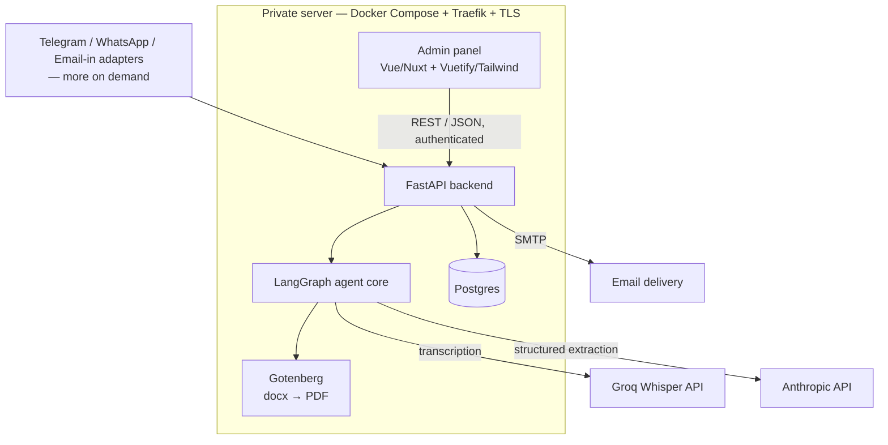
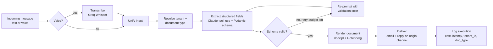
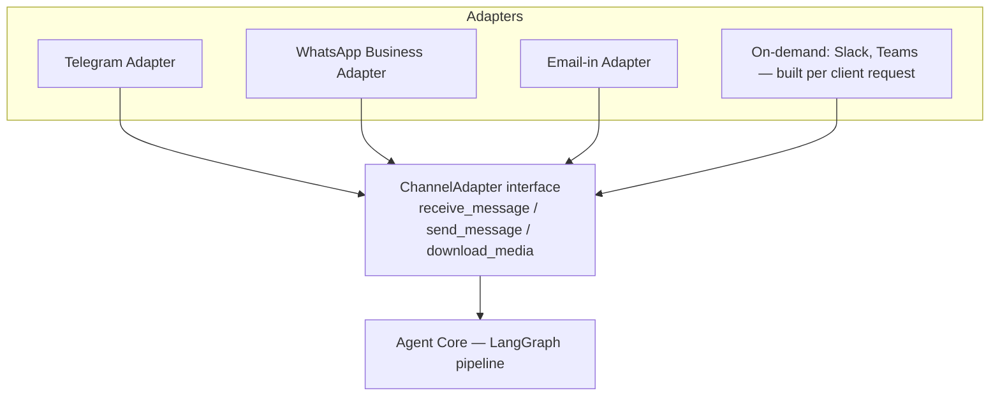

# ReportAI — Development Roadmap

## 1. Overview

ReportAI is an AI agent that turns a voice note or a chat message into a
correctly formatted document (meeting minutes, commercial visit reports, and
future document types), filled into the client's own template and delivered
to the right inbox. Multi-tenant from the data model up: each client
configures their own instance (document templates, fields, channels, users,
recipients) from an admin panel.

This is a working development tracker — phases, checklists, and technical
decisions — not a presentation document.

## 2. Architecture

### Agent pipeline (LangGraph)

### Channel adapter pattern

### Stack summary

- **Backend**: FastAPI, Python
- **Agent orchestration**: LangGraph
- **LLM extraction**: Anthropic Claude, tool-calling / structured output
- **Transcription**: Groq Whisper (whisper-large-v3-turbo)
- **Database**: Postgres, self-hosted (Docker)
- **Document rendering**: docxtpl + self-hosted Gotenberg
- **Admin panel**: Vue/Nuxt + Vuetify/Tailwind
- **Channels**: Telegram, WhatsApp Business Cloud API, Email-in (initial build); Slack and Microsoft Teams built on-demand per client request; Discord, Google Chat, SMS, RCS evaluated and not prioritized (see §5 Phase 3)
- **Infra**: private server (Hetzner-class VPS), Docker Compose, Traefik reverse proxy, Let's Encrypt TLS
- **Auth**: per-tenant login (email/password or magic link), roles: platform super-admin / tenant admin
- **Observability**: structured per-execution logs (cost, latency, tenant_id, document_type)
- **Testing**: unit tests per pipeline node, golden-set eval suite in CI

## 3. Architecture & scope decisions

| Decision | Rationale |
|---|---|
| Fully custom-coded agent (no low-code/workflow-builder tools) | A project living entirely in a no-code tool structurally closes the signal channel hiring managers look for: readable commit history, testable/inspectable architecture, real version control. |
| Multi-tenant SaaS from the data model up, with a client-facing admin panel | Each client configures their own instance (templates, fields, authorized users, recipients) themselves, not through a support ticket. |
| Sales motion stays white-label / consulting-led, not public self-serve | No validated demand yet for public self-serve. Software is SaaS-shaped; go-to-market is relationship-led. Public self-serve signup and billing are explicitly deferred (see §6). |
| Channel-agnostic ingestion via an adapter interface; Telegram, WhatsApp, and email-in built in the initial phase | These are the channels the target audience (non-technical SME field reps, Spain/LatAm) actually uses with zero IT gatekeeping. Slack and Microsoft Teams require per-client setup (OAuth install / Azure Bot + IT admin approval) and are built on-demand when a client requests them, not speculatively. |
| Structured LLM output (tool-calling / schema enforcement), never raw-JSON-in-prompt | Removes an entire class of parsing failures versus asking the model for JSON in free text. |
| Document type & field schema as per-tenant runtime config (Pydantic model built from DB config), not hardcoded prompts | A new client or new document type becomes configuration, not a code change. |
| Self-hosted Postgres on a private server, not a managed BaaS | Long-lived, multi-tenant product — warrants owning the infra rather than a managed backend-as-a-service. |
| Own document rendering: docxtpl (Jinja2-tagged .docx templates) → self-hosted Gotenberg (Docker) for docx→PDF | No opaque black-box dependency, no per-document third-party API receiving confidential content off-server. |
| Golden-set eval suite + structured cost/latency logging from the first commit | Highest-leverage investment for both reliability and demonstrable engineering quality, regardless of priority order. |
| Secrets in environment variables / not committed, from the first commit | Non-negotiable baseline for any multi-tenant system handling client documents. |
| Public repository with sanitized/synthetic data only | No real tenant content ever appears in this repo, in eval datasets, or in the public demo. |
| Real incremental commit history from day one | A single big-bang commit or a squashed import reads as a red flag; history must reflect actual development. |

## 4. Data model overview

Core entities, all tenant-scoped from the first migration:

- `tenants` — one row per client company
- `tenant_users` — admin-panel login accounts, scoped to a tenant (+ one super-admin role)
- `channel_connections` — which channel(s) + credentials a tenant has wired up (Telegram bot token, Slack workspace, Discord bot/guild, etc.)
- `document_types` — per-tenant document definitions (name, field schema as JSON, prompt/instructions)
- `document_templates` — the .docx template file reference + version per document type
- `reports` — generated report records (status, requester, timestamps, links to files)
- `execution_logs` — per-run cost, latency, model calls, success/failure, for observability and future billing

## 5. Development phases

### Phase 0 — Foundations
- [ ] Repo layout (`backend/`, `frontend/`, `infra/`, `docs/`)
- [ ] FastAPI skeleton + Postgres via Docker Compose (local dev)
- [ ] Alembic migrations for the core schema (§4), `tenant_id` on every scoped table
- [ ] `.env.example`, secrets strictly via environment variables
- [ ] Basic CI (lint + test) on push
- [ ] `ChannelAdapter` interface defined (no implementation yet)

### Phase 1 — Agent core + initial channels
- [ ] LangGraph pipeline: ingest → transcribe → resolve tenant/doc type → extract → validate → render → deliver → log
- [ ] Telegram adapter implementing `ChannelAdapter`
- [ ] WhatsApp Business Cloud API adapter implementing `ChannelAdapter` (start Meta Business verification early — 2-5 days typical, up to 4-8 weeks)
- [ ] Email-in adapter implementing `ChannelAdapter` (inbound email parsing, e.g. Mailgun/Cloudflare Email Workers)
- [ ] Claude structured-output extraction with per-tenant Pydantic schema
- [ ] Retry-with-validation-error loop, bounded attempts
- [ ] docxtpl + Gotenberg rendering pipeline
- [ ] Email + in-channel delivery
- [ ] Golden-set eval suite (synthetic data) + unit tests per node
- [ ] Structured execution logging (cost, latency)
- [ ] One seeded demo tenant with fictional data end to end

### Phase 2 — Admin panel
- [ ] Auth (tenant admin login, super-admin role)
- [ ] Tenant management (create/list/deactivate) — super-admin only
- [ ] Document type & template management (upload .docx, define field schema) — tenant admin
- [ ] Channel connection management (link bots per channel, manage allowed users) — tenant admin
- [ ] Recipients / notification settings — tenant admin
- [ ] Report history view with status
- [ ] Usage/cost dashboard per tenant

### Phase 3 — On-demand channel adapters
- [ ] Slack adapter — build when a specific client requests it (self-service OAuth install, low effort)
- [ ] Microsoft Teams adapter — build only when a specific paying Microsoft 365 client requests it; register as a single-tenant Azure Bot scoped to that client (not a multi-tenant Teams Store app — Microsoft disallowed new multi-tenant bots as of 2025-07-31). Requires that client's IT admin to sideload the app package or approve a store listing; budget 1-2 weeks dev plus client-side admin approval time.
- [ ] Evaluated and explicitly not prioritized: Discord (no fit with formal corporate reporting for this audience), Google Chat (same IT-gated integration cost as Teams, far smaller footprint in this market), SMS (can't carry voice notes — breaks the core "send a voice note" flow), RCS (fragmented, immature cross-carrier/OS support). Revisit only if a specific client asks.

### Phase 4 — Deployment & launch
- [ ] Provision private server, Docker Compose + Traefik + TLS
- [ ] Sanitize repo for public release (verify zero real tenant data anywhere in history)
- [ ] Public demo tenant, one-click accessible
- [ ] README with architecture and setup instructions
- [ ] First white-label client deployments sold through existing consulting relationships

### Phase 5 — Deferred (explicitly not now)
- Public self-serve signup
- Billing / payment integration
- Corporate SSO / OAuth for the admin panel
- Multi-region / high-availability infra
- Marketing landing page

## 6. Explicitly out of scope for now

- Public self-serve onboarding and billing (see Phase 5).
- Any channel not yet confirmed via Phase 3 research.

## 7. Known risks

- Real tenant data must never enter the public repo, eval datasets, or demo — synthetic data only, checked before every public push.
- Multi-tenant isolation must be correct before a second real client's data lives on shared infrastructure — a cross-tenant leak would be reputationally severe.
- Scope discipline: this roadmap already includes a full SaaS admin panel and three initial channels by explicit decision (see §3) — resist adding further speculative scope (extra auth methods, billing) without a real trigger.
- Git history must stay genuinely incremental from Phase 0 onward — no big-bang imports.

## 8. Decisions log

| Date | Decision | Owner |
|---|---|---|
| 2026-08-10 | Project is fully custom-coded and independent | Confirmed |
| 2026-08-10 | Business path: white-label deployments via existing consulting relationships, not public self-serve SaaS (yet) | Confirmed |
| 2026-08-10 | Repository will be public, with sanitized/synthetic data | Confirmed |
| 2026-08-10 | Multi-tenant admin panel is in scope for the initial build, not deferred | Confirmed |
| 2026-08-10 | Microsoft Teams cannot be reached via MCP — MCP lets an agent call ReportAI as a tool, it is not a message-transport channel. Teams ingestion requires Azure Bot Service + Entra ID app registration + Teams app manifest, approved per-tenant by the client's IT admin (Microsoft disallowed new multi-tenant bots as of 2025-07-31) | Confirmed (Microsoft Learn) |
| 2026-08-10 | Channel priority reordered: Telegram + WhatsApp Business Cloud API + Email-in for the initial build — the channels the target audience (non-technical SME field reps, Spain/LatAm) actually uses with zero IT gatekeeping. Slack and Microsoft Teams moved to on-demand, per-client build (Phase 3). Discord, Google Chat, SMS, and RCS evaluated and not prioritized. | Recommended — open for override |
| 2026-08-10 | Document rendering: docxtpl + self-hosted Gotenberg | Confirmed |
