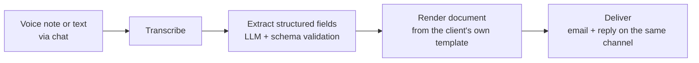

# ReportAI

**Turn a voice note into a finished corporate report.**

ReportAI is an AI agent that converts a voice note or a chat message into a
correctly formatted corporate document — meeting minutes, commercial visit
reports, and other structured report types — filled into your own template
and delivered straight to the right inbox. No app to install: it runs on the
chat platform your team already has open.

A field rep finishes a client visit, sends a 90-second voice note to a bot,
and a formatted report lands in the right inbox a few seconds later — filled
into the company's own template, not a generic AI summary.

## Why this exists

Most AI meeting-note tools (Otter, Fireflies, Fathom, Notion AI Meeting Notes)
are built around a bot joining a scheduled video call. That structurally
misses the case this project targets: an in-person visit or phone call,
recapped afterwards from a phone, with no laptop and no meeting link involved.

On top of that, none of them let a company upload its own Word template and
get it filled exactly as-is — they all return their own generic summary
format instead of a company's actual "Acta de Reunión" or visit report.

ReportAI is built around three things that gap needs:
- **Chat-native, zero install** — the input is a message on a platform people
  already have open, not a new app to learn.
- **Bring your own template** — each client defines their own document types
  and field schema; the agent fills *their* format, not a generic one.
- **Correct, not just fluent** — structured extraction with schema validation
  and an eval suite, because a wrong date or a dropped action item in a
  formal report is a real failure, not a style nitpick.

## How it works

Each client configures their own document templates, field definitions,
connected channels, and recipients from an admin panel — onboarding a new
document type is configuration, not a code change.

## Status

This project is in active development. See
[`PROJECT_ROADMAP.md`](./PROJECT_ROADMAP.md) for the current build phase,
architecture decisions, and what's shipped so far.

## Tech stack

- **Backend**: FastAPI (Python)
- **Agent orchestration**: LangGraph
- **LLM extraction**: Anthropic Claude, structured output / tool-calling
- **Transcription**: Groq Whisper
- **Database**: self-hosted Postgres
- **Document rendering**: docxtpl + self-hosted Gotenberg
- **Admin panel**: Vue/Nuxt + Vuetify/Tailwind
- **Infra**: Docker Compose + Traefik on a private server
